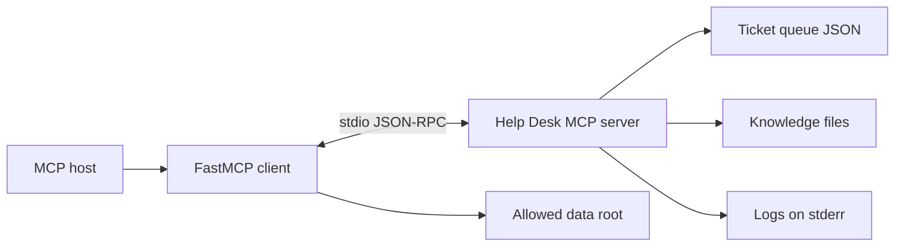

# Architecture

## Transport choice

This project uses **stdio** because the demonstration is local and connects one client to one server process. The client launches the server as a subprocess, no listening network port is opened, and access follows the permissions of the local user. Protocol messages travel over stdin and stdout; application logs go to stderr so they cannot corrupt the MCP stream.

For a shared multi-user deployment, the next step would be Streamable HTTP with TLS, OAuth-based authentication, origin validation, per-user authorization, and centralized telemetry. That additional deployment surface is unnecessary for this local graded demonstration.

